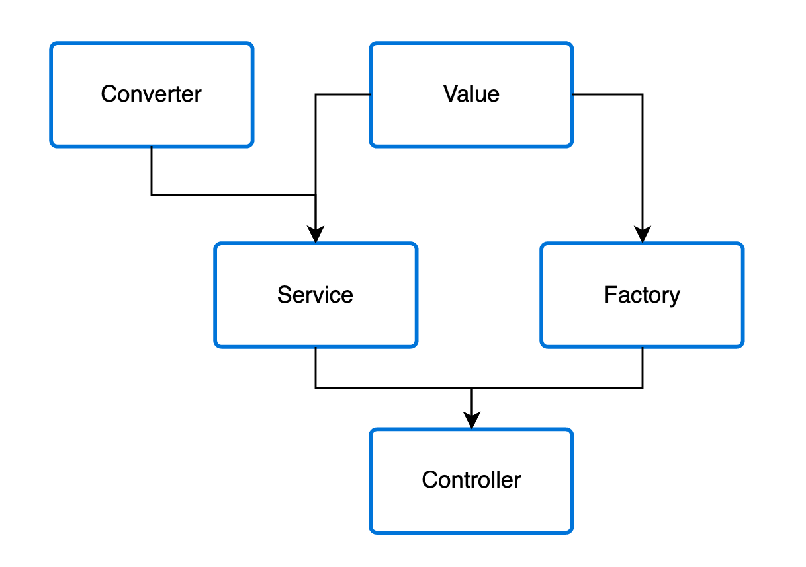

---
meta:
 - name: description
   content: Documentation over Providers / DI provided by Ts.ED framework. Use providers to build your backend services.
 - name: keywords
   content: providers di ioc ts.ed express typescript node.js javascript decorators jsonschema class models
---
# Providers

Basically, almost everything may be considered as a provider – service, factory, interceptors, and so on. 
All of them can inject dependencies, meaning, they can create various relationships with each other.
 But in fact, a provider is nothing else than just a simple class annotated with an `@Injectable()` decorator.
 
<figure></figure>

In controllers chapter, we've seen how to build a Controller, handle request and create a response.
Controllers shall handle HTTP requests and delegate complex tasks to the **providers**.

The providers are plain javascript class and use one of these decorators on top of them. Here the list:

<ApiList query="['Injectable', 'Service', 'Controller', 'Interceptor', 'Converters', 'Middleware', 'MiddlewareError', 'Filter'].indexOf(symbolName) > -1" />

## Services

Let's start by creating a simple CalendarService provider. 

<<< @/docs/docs/snippets/providers/getting-started-service.ts

::: tip Note
@@Service@@ and @@Injectable@@ as the same effect. `@Injectable` accept options, `@Service` not.
A Service is always configured as `singleton`.

Example with `@Injectable`

<<< @/docs/docs/snippets/providers/getting-started-injectable.ts

:::

Now we have the service class already done, let's use it inside the `CalendarCtrl`:

<<< @/docs/docs/snippets/providers/getting-started-controller.ts

Finally, we can load the injector and use it:

<<< @/docs/docs/snippets/providers/getting-started-serverloader.ts

## Dependency injection

Ts.ED is built around the **dependency injection** pattern. TypeScript emit type metadata on the constructor
which will be exploited by the @@InjectorService@@ to resolve dependencies automatically.

```typescript
constructor(private calendarsService: CalendarsService) {}
```

## Scopes

Each provider has a lifetime strictly dependent on the application lifecycle. Once the application is bootstrapped, every given provider has to be instantiated if the provider 
is configured as `singleton`. Similarly, when the application shutdown, each provider will be destroyed. 

However, there are ways to make your provider lifetime request-scoped or instance-scoped as well.

Ts.ED DI define 3 types of @@Scope@@: `singleton`, `request` and `instance` which can be used on `Provider`, `Service`, `Middleware` and `Controller`.

### Singleton scope

Singleton scope is the default behavior of all providers. That means all providers are create on the server initialization.

<<< @/docs/docs/snippets/providers/scope-singleton.ts

::: tip Note
In this example all request on `/random` endpoint return the same random value.
:::

### Request scope

Request scope will create a new instance of provider for each request. A new container will be created
and attached to the request. It'll contains all provider annotated by `@Scope(ProviderScope.REQUEST)`.

<<< @/docs/docs/snippets/providers/scope-singleton.ts

Each request on `/random` will return a different random value.

#### Chain with Service

It also possible to use `@Scope(ProviderScope.REQUEST)` on service if your service is injected on a controller
which is annotated by `@Scope(ProviderScope.REQUEST)` too.

Here a working example:

<<< @/docs/docs/snippets/providers/scope-chain.ts

And here an unworking example:

<<< @/docs/docs/snippets/providers/scope-chain-fail.ts

::: warning
The `SINGLETON` annotation avoid the `@Scope(ProviderScope.REQUEST)` annotation put on MyService.
:::

::: warning
The `@Scope(ProviderScope.REQUEST)` annotation has no effect on Global middlewares.
:::
